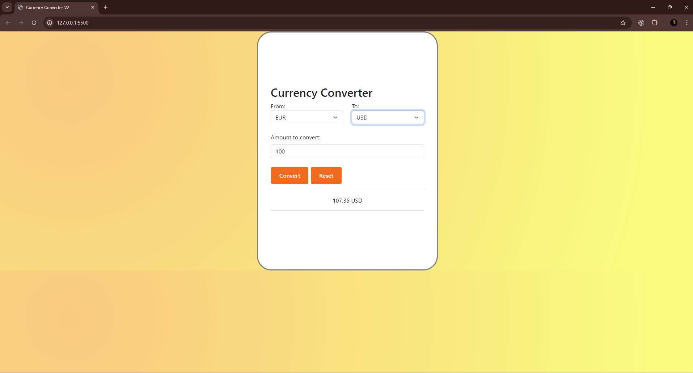

# Currency Converter

Connecting to a third-party API to display latest currency exchange rate.

## Overview

This project would mark the end of the module 1 in Sigma School. I've learned not only how to connect to an API from my Javascript code, but also how to get the data in a form of JSON via async operation (fetch) and displaying it nicely to the user. It tested me on my css understanding, including my usage of styling libraries like bootstrap.

This module taught me not just how to code, but also how to navigate myself through documentations that may or may not be complete in terms of implementation of the process. 

## Credit

Thank you to Sigma School for providing me the opportunity to career-switch into the tech field. Exercises/Lessons/Examples were provided by them. https://sigmaschool.co/
